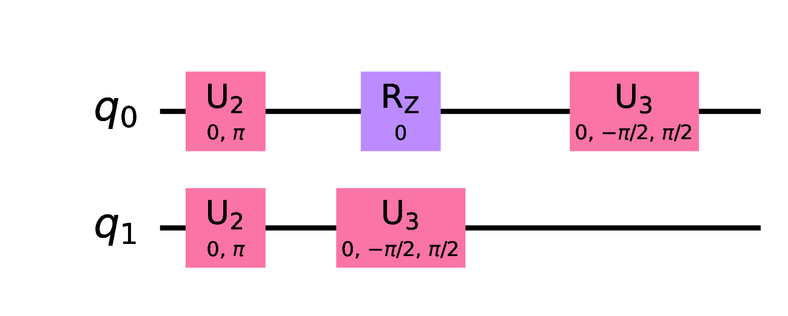

# Instructions to repeat and reproduce the analyses and results in the associated paper

The following sections provides step-by-step instructions to repeat and reproduce the analyses, tables, and figures reported in the associated paper.

## Requirements

All commands / scripts have been tested and used on a Unix-based machine and therefore might not work on other operating systems, e.g., Windows.  This document also assumes the reader is comfortable running bash commands and navigating in/out directories on the command line.

The subsequent analyses require the following tools to be installed and available on your machine (unless the [docker](https://www.docker.com) option is used):
- [GIT](https://git-scm.com) and [GNU wget](https://www.gnu.org/software/wget)
- [Perl - Programming language](https://www.perl.org)
- [GNU Parallel](https://www.gnu.org/software/parallel)
- [R Project for Statistical Computing](https://www.r-project.org)
- [ImageMagick - Convert, Edit, or Compose Digital Images](https://imagemagick.org)

Visit the [REQUIREMENTS.md](REQUIREMENTS.md) file for more details.

## Setup

### [Docker](https://www.docker.com) option

For an easy setup, we recommend our [docker image](https://hub.docker.com/r/josecarloscampos/qsmells-artifact) that includes all scripts, data, and instructions required to [repeat and reproduce](https://www.acm.org/publications/policies/artifact-review-and-badging-current) the study 'The Smelly Eight: An Empirical Study on the Prevalence of Code Smells in Quantum Computing'.  Otherwise, follow the setup instructions in the next section 'Non-Docker option'.

First, pull the docker image

```bash
docker pull josecarloscampos/qsmells-artifact
```

Second, connect to the docker image

```bash
docker run --interactive --tty --privileged --workdir /qsmells-artifact/ josecarloscampos/qsmells-artifact
```

which should lead you to the root directory of the artifact.  Then, follow the following sections which provide step-by-step instructions on which commands to run to repeat and reproduce the experiments described in the associated paper.

### Non-[Docker](https://www.docker.com) option

In the top-level directory [`tools/`](tools/), run the following command

```bash
bash get-tools.sh # (~20 minutes)
```

In case the execution does not finished successfully, the script will print out a message informing the user of the error.  One should follow the instructions to fix the error and re-run the script.  In case the execution of the script finished successfully, one should see the message `DONE! All tools have been successfully installed and configured.` on the stdout.

Visit the [INSTALL.md](INSTALL.md) file for more details.

## RQ1: How do practitioners perceive quantum-specific code smells?

*Section IV.E, Tables II and III*

The top-level [`survey/`](survey/) directory provides the survey's question ([`survey/survey-doc.pdf`](survey/survey-doc.pdf)), data provided by the practitioners ([`survey/data/responses.csv`](survey/data/responses.csv)), and all relevant scripts to analyze that data ([`survey/statistics/`](survey/statistics/)).

- To generated Table II -- Survey results per smell -- run, in the [`survey/statistics/`](survey/statistics/) directory, the following command:

```bash
Rscript results-per-smell-as-table.R \
  ../data/responses.csv \
  results-per-smell.tex # (< 1 minute)
```

- To generated Table III -- Quantum-specific smell's severity -- run, in the [`survey/statistics/`](survey/statistics/) directory, the following command:

```bash
Rscript severity-per-smell-as-table.R \
  ../data/responses.csv \
  severity-per-smell.tex # (< 1 minute)
```

## RQ2: What is the prevalence of quantum-specific code smells in quantum programs?

### Subjects

*Section VI.A*

The top-level [`subjects/`](subjects/) directory provides the list of quantum programs under study ([`subjects/data/subjects.csv`](subjects/data/subjects.csv)), the scripts to collect and process quantum programs' circuit ([`subjects/scripts/`](subjects/scripts/)), and all relevant scripts to analyze programs' circuit metadata, e.g., number of qubits used in each circuit ([`subjects/statistics/`](survey/statistics/)).

#### 1. From quantum programs to execution matrixes

Firstly, to be able to analyze a quantum program (or in other words to run [`QSmell`](https://github.com/jose/qsmell) on a quantum program), we must get its quantum circuit object so that we can then compute its *execution matrix* (see Section V.A.1 for more details).  The [`subjects/scripts/wrappers/`](subjects/scripts/wrappers/) directory already provides a wrapper for each quantum program under study.  These wrappers were manually-created and look like, e.g.,

```python
from qiskit.algorithms import QAOA
from qiskit.opflow import I, X, Z, PauliSumOp

qaoa = QAOA()
ref = qaoa.construct_circuit([0, 0], I ^ Z)[0]

qc = ref
```

for the `QAOA` program.  This wrapper imports the required modules (lines 1 and 2), initialize a new object name `qaoa` of type `QAOA` and construct its circuit (line 4 and 5, respectively), and finally initialize a new variable `qc` with the quantum circuit of the program (line 7).

Secondly, we must compute the *execution matrix* of each quantum circuit.  To achieve this, run, in the [`subjects/scripts/`](subjects/scripts/) directory, the following commands for, e.g., the `QAOA` program

```bash
bash get-quantum-circuit-as-a-matrix.sh \
  --wrapper_name "wrapper_qaoa" \
  --output_dir_path ../data/generated/quantum-circuit-as-matrix # (< 1 minute)

bash get-quantum-circuit-as-a-matrix.sh \
  --wrapper_name "wrapper_qaoa" \
  --transpile "true" \
  --output_dir_path ../data/generated/transpiled-quantum-circuit-as-matrix # (< 1 minute)
```

Note that quantum-specific smells `ROC`, `LC`, `IM`, `IdQ`, and `IQ` require a *transpiled execution matrix* as opposite to the `CG` smell which requires a *raw execution matrix* of a quantum program/circuit.  By executing the two commands above, one would be equipped with both types.

The execution of the [`subjects/scripts/get-quantum-circuit-as-a-matrix.sh`](subjects/scripts/get-quantum-circuit-as-a-matrix.sh) script should generate the [`subjects/data/generated/quantum-circuit-as-matrix/qaoa.csv`](subjects/data/generated/quantum-circuit-as-matrix/qaoa.csv) and [`subjects/data/generated/transpiled-quantum-circuit-as-matrix/qaoa.csv`](subjects/data/generated/transpiled-quantum-circuit-as-matrix/qaoa.csv) files with the following content respectively

```
;1;2;3
q-q-0;h();rz(ParameterExpression);PauliEvolution(ParameterExpression)
q-q-1;h();;PauliEvolution(ParameterExpression)
```

```
;1;2;3
q-q-0;u2(int,float);rz(ParameterExpression);u3(ParameterExpression,ParameterExpression,ParameterExpression)
q-q-1;u2(int,float);u3(ParameterExpression,ParameterExpression,ParameterExpression);
```

To run the [`subjects/scripts/get-quantum-circuit-as-a-matrix.sh`](subjects/scripts/get-quantum-circuit-as-a-matrix.sh) script on all quantum programs at once, run the following commands in the [`subjects/scripts/`](subjects/scripts/) directory

```bash
tail -n +2 ../data/subjects.csv | cut -f2 -d',' | while read -r name; do \
  bash get-quantum-circuit-as-a-matrix.sh \
    --wrapper_name "wrapper_$name" \
    --output_dir_path ../data/generated/quantum-circuit-as-matrix; \
done # (< 2 minutes)

tail -n +2 ../data/subjects.csv | cut -f2 -d',' | while read -r name; do \
  bash get-quantum-circuit-as-a-matrix.sh \
    --wrapper_name "wrapper_$name" \
    --transpile "true" \
    --output_dir_path ../data/generated/transpiled-quantum-circuit-as-matrix; \
done # (~ 2 hours)
```

Assuming the execution of both commands above finished successfully, the [`../data/generated/quantum-circuit-as-matrix/`](../data/generated/quantum-circuit-as-matrix/) and [`../data/generated/transpiled-quantum-circuit-as-matrix/`](../data/generated/transpiled-quantum-circuit-as-matrix/) directories should have 17 CVS files, as many as the number of quantum programs under study.

#### 2. From quantum programs to drawings

Given a wrapper to a quantum program, one could also draw each quantum circuit in different formats (PDF, PNG, TEX, and TXT) by running, in the [`subjects/scripts/`](subjects/scripts/) directory, the following command for, e.g., the `QAOA` program

```bash
bash get-quantum-circuit-as-a-draw.sh \
  --wrapper_name "wrapper_qaoa" \
  --output_dir_path ../data/generated/transpiled-quantum-circuit-as-draw # (< 1 minute)
```

As an example, here is the PNG image generated by the script, for the `QAOA` program

<!--  -->


or the TXT file

```
┌─────────┐    ┌───────┐     ┌────────────────┐
q_0: ┤ U2(0,π) ├────┤ Rz(0) ├─────┤ U3(0,-π/2,π/2) ├
├─────────┤┌───┴───────┴────┐└────────────────┘
q_1: ┤ U2(0,π) ├┤ U3(0,-π/2,π/2) ├──────────────────
└─────────┘└────────────────┘
```

#### 3. Collect execution matrixes' metadata

Thirdly, to collect *execution matrixes'* metadata, or in other words quantum circuit's metadata, as number of qubits, number of classical bits, and number of operations, in the [`subjects/scripts/`](subjects/scripts/) directory, run the following command

```bash
bash get-matrices-data.sh \
  --subjects_file_path ../data/subjects.csv \
  --matrices_dir_path ../data/generated/transpiled-quantum-circuit-as-matrix \
  --output_file_path ../data/generated/transpiled-matrices-data.csv # (< 1 minute)
```

which should generate the [`subjects/data/generated/transpiled-matrices-data.csv`](subjects/data/generated/transpiled-matrices-data.csv) file

```
origin,name,path,num_qubits,num_clbits,num_ops
qiskit,grover,qiskit-terra/qiskit/algorithms/amplitude_amplifiers/grover.py,2,0,21
qiskit,ae,qiskit-terra/qiskit/algorithms/amplitude_estimators/ae.py,6,5,868
...
qiskit,qaoa,qiskit-terra/qiskit/algorithms/minimum_eigen_solvers/qaoa.py,2,0,3
...
```

(Description of the [`subjects/data/generated/transpiled-matrices-data.csv`](subjects/data/generated/transpiled-matrices-data.csv) file can be found in [`subjects/data/FILE-SPECS.md`](subjects/data/FILE-SPECS.md).)

#### 4. Collect quantum programs' metadata

Finally, one could also collect the number of lines of code of each quantum program by, in the [`subjects/scripts/`](subjects/scripts/) directory, running the following command

```bash
bash get-locs.sh \
  --subjects_file_path ../data/subjects.csv \
  --output_file_path ../data/generated/subjects-locs.csv # (< 1 minute)
```

which should generate the [`subjects/data/generated/subjects-locs.csv`](subjects/data/generated/subjects-locs.csv) file.
(Description of the [`subjects/data/generated/subjects-locs.csv`](subjects/data/generated/subjects-locs.csv) file can be found in [`subjects/data/FILE-SPECS.md`](subjects/data/FILE-SPECS.md).)

Note that the number of lines of code, number of qubits, number of classical bits, and number of operations are reported at the end of Section VI.A.

### Experiments

*Section VI.C, Table V*

The top-level [`experiments/`](experiments/) directory provides the script to run [`QSmell`](https://github.com/jose/qsmell) on a single quantum program (i.e., an *execution matrix*) or on all quantum programs under test.  It also provides the relevant scripts to analyze the generated by [`QSmell`](https://github.com/jose/qsmell).

#### 1. Run [`QSmell`](https://github.com/jose/qsmell)

To run [`QSmell`](https://github.com/jose/qsmell) on a single quantum program and one specific code smell, one could use the [`experiments/scripts/run-qsmell.sh`](experiments/scripts/run-qsmell.sh) script.  For example, to run [`QSmell`](https://github.com/jose/qsmell) on the `QAOA` program on the quantum-specific smell `IdQ`

```bash
bash run-qsmell.sh \
  --input_file_path ../../subjects/data/generated/transpiled-quantum-circuit-as-matrix/qaoa.csv \
  --smell_metric "IdQ" \
  --output_file_path ../data/generated/qsmell-metrics/IdQ/qaoa/data.csv # (< 1 minute)
```

(Description of the [`experiments/data/generated/qsmell-metrics/IdQ/qaoa/data.csv`](experiments/data/generated/qsmell-metrics/IdQ/qaoa/data.csv) file generated by the [`experiments/scripts/run-qsmell.sh`](experiments/scripts/run-qsmell.sh) script can be found in [`experiments/data/FILE-SPECS.md`](experiments/data/FILE-SPECS.md).)

To run, all smells on all programs one might use the [`experiments/scripts/run-qsmell-on-all-subjects-all-metrics.sh`](experiments/scripts/run-qsmell-on-all-subjects-all-metrics.sh) script, which basically invokes the [`experiments/scripts/run-qsmell.sh`](experiments/scripts/run-qsmell.sh) script on all programs, in parallel through [GNU Parallel](https://www.gnu.org/software/parallel).  For instance,

```bash
bash run-qsmell-on-all-subjects-all-metrics.sh \
  --subjects_file_path ../../subjects/data/subjects.csv \
  --matrices_dir_path ../../subjects/data/generated/quantum-circuit-as-matrix \
  --transpiled_matrices_dir_path ../../subjects/data/generated/transpiled-quantum-circuit-as-matrix \
  --output_dir_path ../data/generated/qsmell-metrics # (~ 20 minutes)
```

Note: given the specifications of each quantum-specific smell, i.e.:
- Smells `CG`, `ROC`, `LC`, `IM`, `IdQ`, and `IQ` require the *execution matrix* of a quantum program/circuit (as described in Section V.A.1).
- Smells `NC` and `LPQ` require the source code of a quantum program (as described in Section V.A.2).

It is highly recommend the use of the [`experiments/scripts/run-qsmell-on-all-subjects-all-metrics.sh`](experiments/scripts/run-qsmell-on-all-subjects-all-metrics.sh) script, which already implements these rules, instead of the [`experiments/scripts/run-qsmell.sh`](experiments/scripts/run-qsmell.sh) script alone.

#### 2. Analyze [`QSmell's`](https://github.com/jose/qsmell) data

- To generated Table IV -- Rater A/B vs. QSmell -- run, in the [`experiments/statistics/`](experiments/statistics/) directory, the following command:

```bash
Rscript raters-vs-qsmell-metrics-as-table.R \
  ../data/peer-evaluation-of-qsmell-v1.csv \
  ../data/generated/qsmell-metrics/data.csv \
  raters-vs-qsmell-metrics.tex # (< 1 minute)
```

- To generated Table V -- Quantum-specific smell's -- run, in the [`experiments/statistics/`](experiments/statistics/) directory, the following command:

```bash
Rscript smell-metrics-as-table.R \
  ../data/generated/qsmell-metrics/data.csv \
  qsmell-metrics.tex # (< 1 minute)
```
